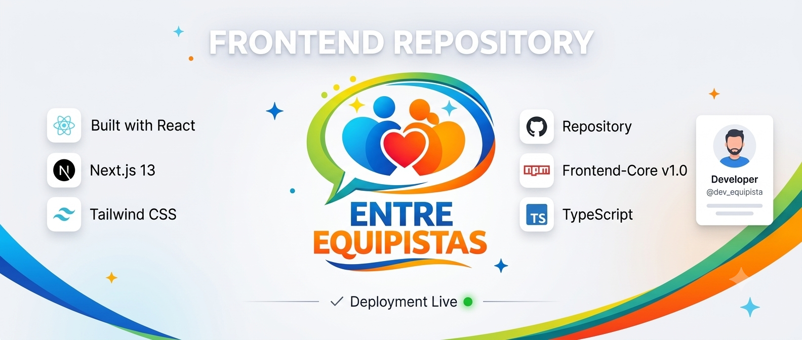
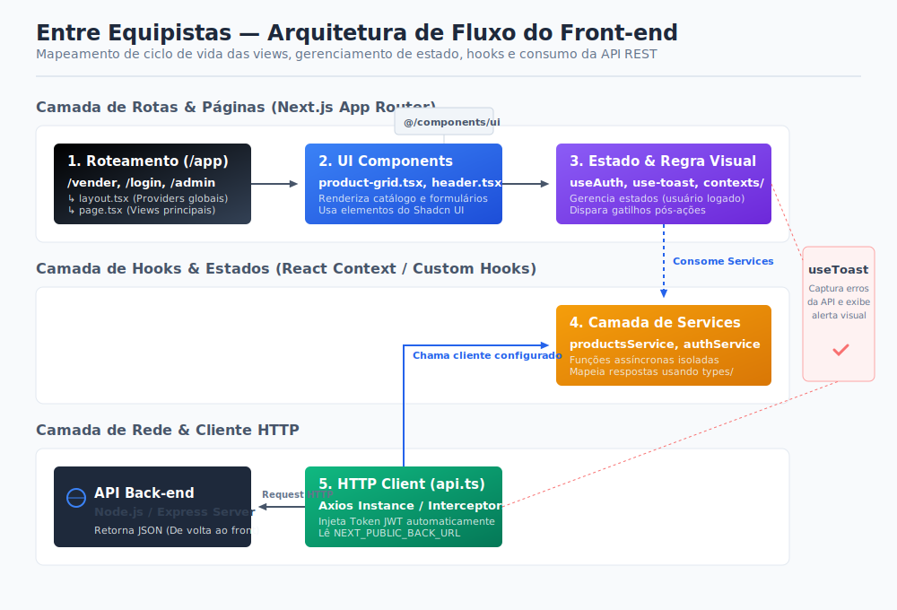
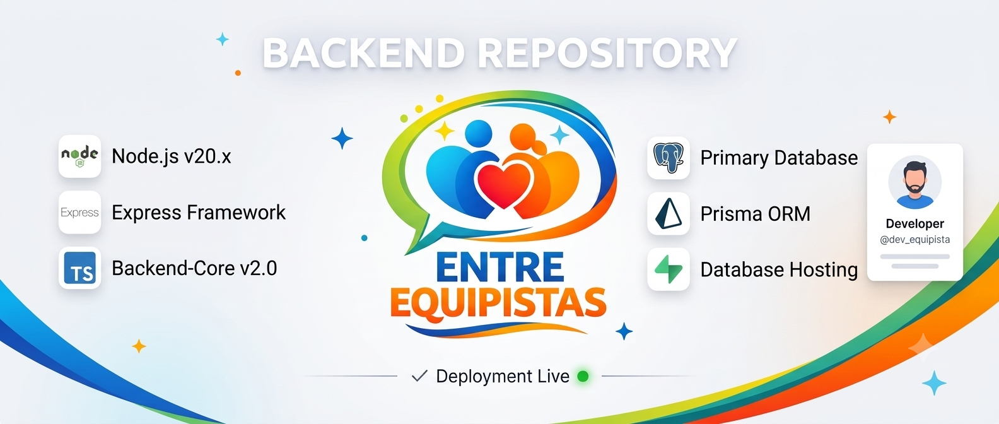

#  Marketplace Entre Equipistas (Front-end)



##  Introdução:

Este repositório contém a interface web do **Marketplace Entre Equipistas**, uma plataforma privada desenvolvida para a comunidade de equipistas de um grupo religioso em Caruaru. O projeto foi desenvolvido utilizando **Next.js 14** com a arquitetura **App Router**, proporcionando uma experiência de navegação rápida, moderna e responsiva. Toda a aplicação é escrita em **TypeScript**, garantindo maior segurança, organização e escalabilidade durante o desenvolvimento.

A interface consome a API REST do back-end para gerenciar de forma dinâmica:

* Autenticação de usuários;
* Catálogo de produtos;
* Cadastro de endereços;
* Painel administrativo;
* Gerenciamento de anúncios.

A arquitetura foi organizada em componentes reutilizáveis e serviços desacoplados, facilitando a manutenção e evolução da aplicação.

---

##  Objetivo do Projeto:

O principal objetivo do front-end é fornecer uma experiência de uso simples, intuitiva e eficiente para os equipistas, permitindo a compra e venda de produtos dentro da comunidade.

Para atingir esse objetivo, o projeto foi desenvolvido com foco nos seguintes aspectos:

###  Navegação otimizada:

Utilização do **Next.js App Router** para criar páginas rápidas, carregamento otimizado e transições fluidas entre as rotas da aplicação.

### Componentização reutilizável:

Criação de componentes independentes e reutilizáveis, como:

* Cards de produtos;
* Grades de produtos;
* Barra de navegação;
* Filtros;
* Componentes de interface.

Essa abordagem facilita a manutenção e expansão do sistema.

###  Integração com a API

Todas as requisições HTTP ficam centralizadas na camada de **Services**, permitindo que os componentes da interface apenas consumam dados já tratados.

Essa separação melhora a organização do código e reduz o acoplamento entre interface e regras de negócio.

###  Gerenciamento de estados:

Controle de estados da aplicação para funcionalidades como:

* autenticação;
* filtros de pesquisa;
* carregamento de dados;
* notificações (Toasts);
* modais;
* feedback visual para o usuário.

### Painéis específicos por perfil:

A interface apresenta funcionalidades diferentes conforme o perfil do usuário autenticado:

* **Comprador:** navegação pelo marketplace e visualização dos produtos;
* **Vendedor:** gerenciamento dos próprios anúncios;
* **Administrador:** moderação de usuários e gerenciamento da plataforma.

---

##  Tecnologias Utilizadas

<p align="center">
  
  
  
  
  
  
</p>

---

##  Etapas do Projeto & Funcionalidades:



O front-end foi estruturado utilizando a arquitetura do **Next.js App Router**, organizando o código em módulos independentes e de fácil manutenção.

###  Módulo de Páginas e Rotas (`app`):

Responsável pelas principais páginas da aplicação.

#### Marketplace

Página inicial da aplicação responsável por exibir o catálogo de produtos disponíveis.

####  Login

Tela destinada à autenticação dos usuários da plataforma.

#### Área do Vendedor

Painel onde o usuário pode:

* cadastrar novos produtos;
* editar anúncios;
* acompanhar seus produtos cadastrados.

#### Painel Administrativo

Área exclusiva para administradores responsável pelo gerenciamento dos usuários da plataforma.

---

### Módulo de Componentes (`components`):

Conjunto de componentes reutilizáveis utilizados em toda a aplicação.

Entre os principais componentes estão:

* `Header`
* `Product Card`
* `Product Grid`
* `Sidebar Filters`

Além disso, o projeto utiliza:

* Shadcn UI;
* Theme Provider;
* Componentes reutilizáveis para formulários, botões, diálogos e notificações.

---

### Módulo de Serviços (`services`)

Camada responsável pela comunicação com o back-end.

Sua principal responsabilidade é centralizar todas as chamadas HTTP da aplicação.

Entre os serviços implementados estão:

* `api.ts`
* `authService.ts`
* `productsService.ts`
* `addressesService.ts`
* `adminService.ts`

Essa organização evita duplicação de código e facilita futuras manutenções.

---

### Tipagens (`types`)

Toda a aplicação utiliza **TypeScript** com tipagem fortemente definida.

As interfaces representam exatamente as entidades existentes no banco de dados, garantindo:

* maior segurança durante o desenvolvimento;
* melhor experiência com autocomplete;
* redução de erros em tempo de execução;
* maior facilidade de manutenção.

## Visualização das Telas do Projeto:


## Como Executar o Projeto:

Siga os passos abaixo para configurar e executar o front-end do Marketplace em ambiente de desenvolvimento.

---

### 1. Clonar o Repositório

Clone o repositório e acesse a pasta do projeto:

```bash
git clone https://github.com/micaellimaj/marktplace-equipistas
```

### 2. Instalar as Dependências

Abra o terminal na pasta do projeto e instale todas as dependências utilizando o **npm**.

```bash
npm install
```

---

### 3. Configurar as Variáveis de Ambiente

Crie um arquivo chamado `.env` na raiz do projeto.

```bash
touch .env
```

Em seguida, configure a URL da API do back-end:

```env
# URL da API do Back-end
NEXT_PUBLIC_BACK_URL="http://localhost:3333"
```

> **💡 Observação**
>
> Caso o back-end esteja hospedado em produção, substitua a URL local pela URL do servidor.

---

### 4. Executar o Projeto

Inicie o servidor de desenvolvimento do Next.js.

```bash
npm run dev
```

Após a inicialização, a aplicação estará disponível em:

```text
http://localhost:3000
```

---

## Estrutura do Repositório:

```
MARKETPLACE-EQUIPISTAS/
├── app/                               # Sistema de Rotas (App Router)
│   ├── admin/                         # Painel Administrativo
│   │   └── page.tsx
│   ├── login/                         # Página de Login
│   │   └── page.tsx
│   ├── vender/                        # Área do Vendedor
│   │   └── page.tsx
│   ├── globals.css                    # Estilos globais
│   ├── layout.tsx                     # Layout principal da aplicação
│   └── page.tsx                       # Página inicial do Marketplace
│
├── components/                        # Componentes reutilizáveis
│   ├── marketplace/
│   │   ├── header.tsx
│   │   ├── product-card.tsx
│   │   ├── product-grid.tsx
│   │   └── sidebar-filters.tsx
│   ├── ui/                            # Componentes do Shadcn UI
│   └── theme-provider.tsx             # Provider de temas
│
├── contexts/                          # Contextos globais do React
│
├── hooks/                             # Hooks customizados
│
├── lib/                               # Funções utilitárias
│
├── public/                            # Arquivos estáticos
│
├── services/                          # Comunicação com a API
│   ├── api.ts
│   ├── authService.ts
│   ├── productsService.ts
│   ├── addressesService.ts
│   └── adminService.ts
│
├── styles/                            # Arquivos adicionais de estilos
│
├── types/                             # Interfaces TypeScript
│   ├── admin.ts
│   ├── auth.ts
│   ├── addresses.ts
│   └── products.ts
│
├── .env                               # Variáveis de ambiente
├── components.json                    # Configuração do Shadcn UI
├── next.config.mjs                    # Configuração do Next.js
├── package.json                       # Dependências e scripts
├── pnpm-lock.yaml                     # Lockfile do PNPM
└── tsconfig.json                      # Configuração do TypeScript
```

---

### Organização do Projeto:

A estrutura do projeto foi organizada seguindo boas práticas de desenvolvimento com **Next.js**, priorizando modularização, reutilização de componentes e separação de responsabilidades.

#### `app/`

Responsável pelas páginas da aplicação utilizando o **App Router** do Next.js.

#### `components/`

Contém todos os componentes reutilizáveis da interface, separados entre componentes específicos do marketplace e componentes da biblioteca **Shadcn UI**.

#### `services/`

Centraliza toda a comunicação HTTP com a API do back-end.

#### `contexts/`

Armazena os Context Providers globais da aplicação, como autenticação e gerenciamento de estado.

#### `hooks/`

Reúne hooks personalizados reutilizados em diferentes partes da aplicação.

#### `types/`

Contém todas as interfaces e tipos TypeScript utilizados para representar os dados consumidos da API.

#### `lib/`

Agrupa funções utilitárias e configurações compartilhadas entre os módulos da aplicação.

#### `public/`

Armazena imagens, ícones, logos e demais arquivos estáticos utilizados pela interface.

## Repositório do Backend:

Para Conhecer o repositório do back-end do projeto, acesse o link abaixo.

<div align="center">
  <a href="https://github.com/micaellimaj/MarketPlace-Entre-Equipistas">
    <table border="0" style="border: none;">
      <tr>
        <td align="center" style="background: #f8fafc; padding: 40px; border-radius: 12px; border: 1px solid #e2e8f0; width: 800px;">
          <br><br>
          <span style="font-family: sans-serif; font-size: 24px; font-weight: bold; color: #64748b; letter-spacing: 6px;">BACKEND</span>
        </td>
      </tr>
    </table>
  </a>
</div>

## Conclusão:

O **Marketplace Entre Equipistas** foi desenvolvido com o objetivo de oferecer uma plataforma moderna, intuitiva e eficiente para facilitar a compra e venda de produtos entre os membros da comunidade.

A utilização do **Next.js 14**, **React**, **TypeScript** e **Tailwind CSS** permitiu construir uma aplicação com excelente desempenho, interface responsiva e arquitetura escalável. A separação entre páginas, componentes, serviços e tipagens torna o projeto mais organizado, facilitando futuras manutenções e a implementação de novas funcionalidades.

A comunicação com a API foi estruturada em uma camada dedicada de serviços, promovendo baixo acoplamento entre a interface e as regras de negócio. Além disso, o uso de componentes reutilizáveis contribui para uma experiência de desenvolvimento mais consistente e produtiva.

Entre os principais recursos implementados, destacam-se:

*  Autenticação de usuários;
*  Catálogo de produtos;
*  Cadastro e gerenciamento de anúncios;
*  Gerenciamento de endereços;
*  Filtros de pesquisa;
*  Painel administrativo;
*  Interface responsiva para diferentes dispositivos.

Com essa arquitetura, o projeto demonstra a aplicação de boas práticas de desenvolvimento front-end, incluindo componentização, tipagem estática, consumo de APIs REST, organização em camadas e reutilização de código.

Este projeto representa uma solução completa para o desafio proposto, integrando-se ao back-end por meio de uma API REST e entregando uma experiência de usuário moderna, fluida e preparada para evoluções futuras.


